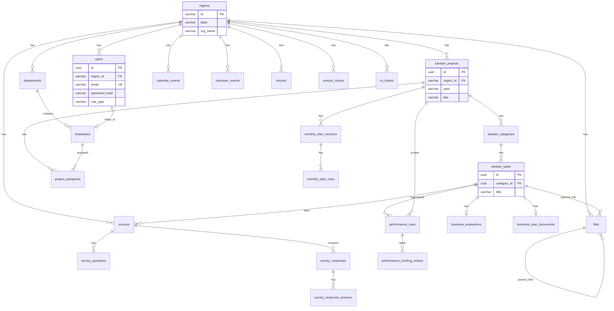
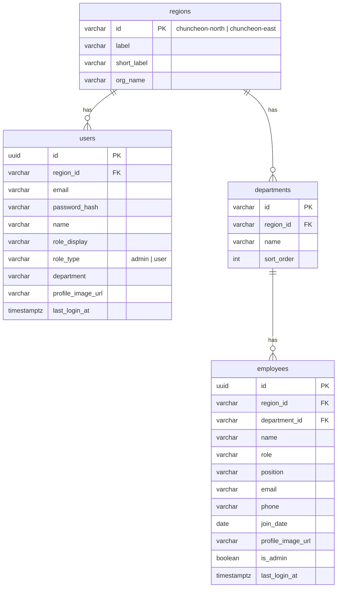
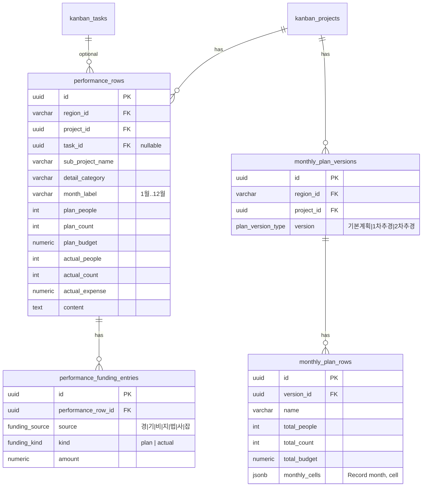
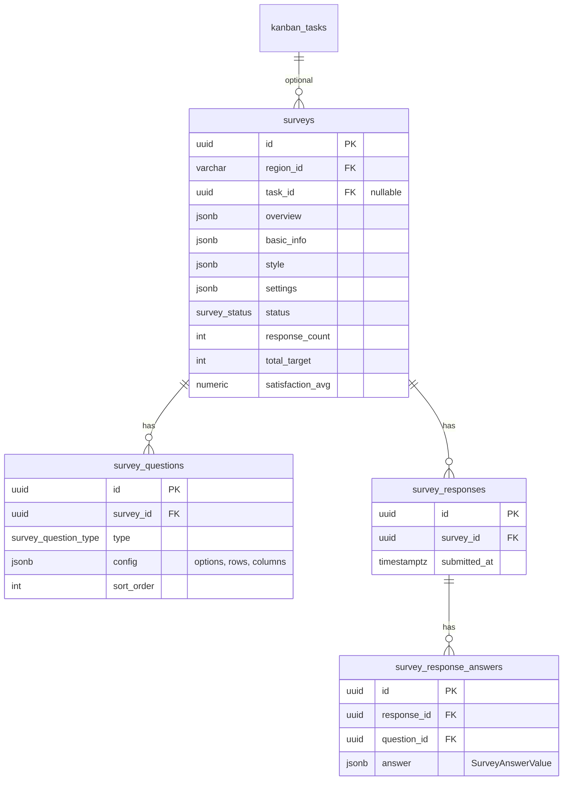
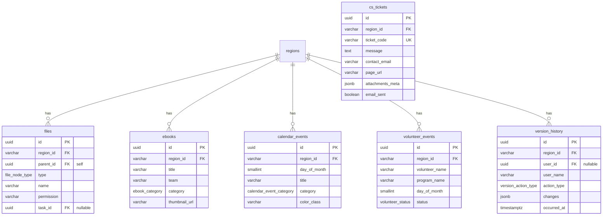

# BOMIBOT 데이터베이스 ERD · 스키마

> **최종 갱신:** 2026-06-08  
> **근거:** `services/*.types.ts`, `lib/mocks/*`, [API_SPEC.md](./API_SPEC.md)  
> **대상 DB:** PostgreSQL 권장 (JSONB·ENUM·UUID)  
> **멀티 테넌트:** `region_id` = `chuncheon-north` | `chuncheon-east`

프론트엔드 mock은 지역별 `region-store`로 데이터를 분리합니다. 백엔드 DB도 **모든 비즈니스 테이블에 `region_id` FK**를 두는 것을 기준으로 설계했습니다.

> **JSON 도메인(`region_json_stores`):** 설문·파일·전자책·실적·task-detail·버전이력·리포트·챗·전자결재에 더해 **`document_templates`(양식 자동작성)** 도메인이 추가되었습니다. `(region_id, domain)` 키, payload는 JSONB. 양식 원본 바이트는 파일스토리지에 보관하고 메타·`frontendJson`만 JSON 도메인에 저장합니다.

---

## 목차

1. [설계 원칙](#1-설계-원칙)
2. [전체 ERD](#2-전체-erd)
3. [도메인별 ERD](#3-도메인별-erd)
4. [테이블 정의](#4-테이블-정의)
5. [ENUM · 공통 타입](#5-enum--공통-타입)
6. [JSONB 컬럼 상세](#6-jsonb-컬럼-상세)
7. [집계·뷰 (API 대응)](#7-집계뷰-api-대응)
8. [인덱스 권장](#8-인덱스-권장)
9. [프론트 타입 매핑](#9-프론트-타입-매핑)

---

## 1. 설계 원칙

| 원칙 | 설명 |
|------|------|
| **Region 스코프** | 복지관(북부/동부) 단위 데이터 격리. `regions` 마스터 + 모든 업무 테이블에 `region_id` |
| **UUID PK** | `id UUID PRIMARY KEY DEFAULT gen_random_uuid()` |
| **감사 컬럼** | `created_at`, `updated_at`, `deleted_at`(soft delete) 공통 |
| **칸반 정규화** | `projects` → `categories` → `tasks` 3단 (mock의 nested 구조 분리) |
| **문서형 JSONB** | 사업평가·사업계획서·설문 문항 등 가변 구조는 JSONB + GIN 인덱스 |
| **실적 이원화** | `performance_rows`(입력관리) + `monthly_plan_versions`(월별계획 시트) |
| **설문 통합** | 글로벌 `surveys` + `task_id` nullable로 칸반 업무 연동 |

---

## 2. 전체 ERD



---

## 3. 도메인별 ERD

### 3.1 인증 · 조직



### 3.2 칸반 · 업무 상세

```mermaid
erDiagram
    kanban_projects ||--o{ kanban_categories : has
    kanban_categories ||--o{ kanban_tasks : has
    kanban_tasks ||--o| business_evaluations : has
    kanban_tasks ||--o| business_plan_documents : has

    kanban_projects {
        uuid id PK
        varchar region_id FK
        varchar number
        varchar title
        varchar project_name
        varchar team
        varchar manager
        varchar image_url
        varchar year
        text description
    }

    kanban_categories {
        uuid id PK
        uuid project_id FK
        kanban_column_type title
        varchar color
        int sort_order
    }

    kanban_tasks {
        uuid id PK
        uuid category_id FK
        varchar title
        text description
        varchar assignee_name
        int sort_order
    }

    business_evaluations {
        uuid id PK
        uuid task_id FK UK
        jsonb detail_rows
        jsonb sections
        jsonb goals
        boolean is_completed
        date evaluation_date
    }

    business_plan_documents {
        uuid id PK
        uuid task_id FK UK
        jsonb form_data
        jsonb sections
        boolean is_completed
    }
```

`kanban_column_type`: `실적관리` | `사업계획` | `만족도조사` | `사업평가`

### 3.3 실적 관리



> **참고:** 사업계획/실적/결과 **요약 시트**(`PerformanceSummaryRow`)는 DB 테이블 대신 `performance_rows` 집계 뷰 또는 API 계층에서 생성 (프론트 `inputRowsToSummaryRows`).

### 3.4 만족도 조사



### 3.5 파일 · 전자책 · 대시보드 · 기타



---

## 4. 테이블 정의

### 4.1 `regions` (테넌트)

| 컬럼 | 타입 | 제약 | 설명 |
|------|------|------|------|
| id | VARCHAR(32) | PK | `chuncheon-north`, `chuncheon-east` |
| label | VARCHAR(50) | NOT NULL | 춘천 북부 |
| short_label | VARCHAR(20) | NOT NULL | 북부 |
| org_name | VARCHAR(100) | NOT NULL | 춘천북부노인복지관 |
| created_at | TIMESTAMPTZ | NOT NULL | |
| updated_at | TIMESTAMPTZ | NOT NULL | |

**시드**

| id | label | org_name |
|----|-------|----------|
| chuncheon-north | 춘천 북부 | 춘천북부노인복지관 |
| chuncheon-east | 춘천 동부 | 춘천동부노인복지관 |

---

### 4.2 `users`

| 컬럼 | 타입 | 제약 | 설명 |
|------|------|------|------|
| id | UUID | PK | |
| region_id | VARCHAR(32) | FK → regions | 로그인 시 선택 지역 |
| email | VARCHAR(255) | NOT NULL | |
| password_hash | VARCHAR(255) | NOT NULL | bcrypt 등 |
| name | VARCHAR(100) | NOT NULL | |
| role_display | VARCHAR(50) | NOT NULL | 관리자, 사회복지사 |
| role_type | VARCHAR(20) | NOT NULL | `admin` \| `user` |
| department | VARCHAR(100) | | |
| profile_image_url | VARCHAR(500) | | |
| employee_id | UUID | FK → employees, NULL | 직원 연동 |
| last_login_at | TIMESTAMPTZ | | |
| created_at | TIMESTAMPTZ | NOT NULL | |
| updated_at | TIMESTAMPTZ | NOT NULL | |

**UNIQUE:** `(region_id, email)`

---

### 4.3 `departments`

| 컬럼 | 타입 | 제약 | 설명 |
|------|------|------|------|
| id | VARCHAR(50) | PK | 예: `management` |
| region_id | VARCHAR(32) | FK | |
| name | VARCHAR(100) | NOT NULL | 운영총괄 |
| sort_order | INT | DEFAULT 0 | |
| created_at | TIMESTAMPTZ | NOT NULL | |
| updated_at | TIMESTAMPTZ | NOT NULL | |

---

### 4.4 `employees`

| 컬럼 | 타입 | 제약 | 설명 |
|------|------|------|------|
| id | UUID | PK | |
| region_id | VARCHAR(32) | FK | |
| department_id | VARCHAR(50) | FK → departments | |
| name | VARCHAR(100) | NOT NULL | |
| role | VARCHAR(50) | | 직책 표시 |
| position | VARCHAR(50) | | 관장, 사회복지사 |
| email | VARCHAR(255) | | |
| phone | VARCHAR(30) | | |
| join_date | DATE | | |
| tenure_display | VARCHAR(30) | | 6년 2개월 (표시용) |
| profile_image_url | VARCHAR(500) | | |
| is_admin | BOOLEAN | DEFAULT false | |
| last_login_at | TIMESTAMPTZ | | |
| created_at | TIMESTAMPTZ | NOT NULL | |
| updated_at | TIMESTAMPTZ | NOT NULL | |

---

### 4.5 `kanban_projects`

| 컬럼 | 타입 | 제약 | 설명 |
|------|------|------|------|
| id | UUID | PK | |
| region_id | VARCHAR(32) | FK | |
| number | VARCHAR(20) | | 사업 번호 |
| title | VARCHAR(200) | NOT NULL | 세부사업명 |
| project_name | VARCHAR(200) | | 대분류 사업명 |
| team | VARCHAR(100) | | 복지 1팀 |
| manager | VARCHAR(100) | | |
| image_url | VARCHAR(500) | | |
| year | CHAR(4) | NOT NULL | 2026 |
| description | TEXT | | |
| created_at | TIMESTAMPTZ | NOT NULL | |
| updated_at | TIMESTAMPTZ | NOT NULL | |
| deleted_at | TIMESTAMPTZ | | |

**인덱스:** `(region_id, year)`

---

### 4.6 `kanban_categories`

| 컬럼 | 타입 | 제약 | 설명 |
|------|------|------|------|
| id | UUID | PK | |
| project_id | UUID | FK → kanban_projects | |
| title | kanban_column_type | NOT NULL | 실적관리 등 |
| color | VARCHAR(50) | | Tailwind class |
| sort_order | INT | DEFAULT 0 | 파이프라인 순서 |
| created_at | TIMESTAMPTZ | NOT NULL | |
| updated_at | TIMESTAMPTZ | NOT NULL | |

**UNIQUE:** `(project_id, title)` — 프로젝트당 컬럼 4개 고정

---

### 4.7 `kanban_tasks`

| 컬럼 | 타입 | 제약 | 설명 |
|------|------|------|------|
| id | UUID | PK | |
| category_id | UUID | FK → kanban_categories | |
| title | VARCHAR(300) | NOT NULL | |
| description | TEXT | | |
| assignee_name | VARCHAR(100) | | |
| sort_order | INT | DEFAULT 0 | |
| created_at | TIMESTAMPTZ | NOT NULL | |
| updated_at | TIMESTAMPTZ | NOT NULL | |
| deleted_at | TIMESTAMPTZ | | |

---

### 4.8 `project_assignees` (M:N)

프로젝트 생성 시 `assignees[]` 대응.

| 컬럼 | 타입 | 제약 |
|------|------|------|
| project_id | UUID | FK, PK composite |
| employee_id | UUID | FK, PK composite |
| created_at | TIMESTAMPTZ | |

---

### 4.9 `business_evaluations`

| 컬럼 | 타입 | 제약 | 설명 |
|------|------|------|------|
| id | UUID | PK | |
| region_id | VARCHAR(32) | FK | |
| task_id | UUID | FK → kanban_tasks, UNIQUE | 1:1 |
| team | VARCHAR(100) | | |
| manager | VARCHAR(100) | | |
| period | VARCHAR(100) | | |
| program_name | VARCHAR(200) | | |
| target | TEXT | | |
| plan_count | VARCHAR(50) | | |
| plan_budget | VARCHAR(50) | | |
| actual_count | VARCHAR(50) | | |
| actual_expense | VARCHAR(50) | | |
| purpose | TEXT | | |
| goals | JSONB | | `string[]` |
| performance_indicator | TEXT | | |
| evaluation_tool | TEXT | | |
| key_factor_analysis | TEXT | | |
| goal_appropriacy | TEXT | | |
| suggestion | TEXT | | |
| supervision | TEXT | | |
| evaluation_date | DATE | | |
| is_completed | BOOLEAN | DEFAULT false | |
| detail_rows | JSONB | | `EvaluationDetailRow[]` |
| sections | JSONB | | `EvaluationSection[]` |
| created_at | TIMESTAMPTZ | NOT NULL | |
| updated_at | TIMESTAMPTZ | NOT NULL | |

---

### 4.10 `business_plan_documents`

| 컬럼 | 타입 | 제약 | 설명 |
|------|------|------|------|
| id | UUID | PK | |
| region_id | VARCHAR(32) | FK | |
| task_id | UUID | FK, UNIQUE | |
| form_data | JSONB | NOT NULL | `BusinessPlanFormData` |
| sections | JSONB | NOT NULL | `BusinessPlanSection[]` |
| is_completed | BOOLEAN | DEFAULT false | |
| created_at | TIMESTAMPTZ | NOT NULL | |
| updated_at | TIMESTAMPTZ | NOT NULL | |

---

### 4.11 `performance_rows`

| 컬럼 | 타입 | 제약 | 설명 |
|------|------|------|------|
| id | UUID | PK | |
| region_id | VARCHAR(32) | FK | |
| project_id | UUID | FK | |
| task_id | UUID | FK, NULL | |
| sub_project | VARCHAR(200) | NOT NULL | |
| detail_category | VARCHAR(100) | | |
| month | VARCHAR(10) | NOT NULL | 1월 |
| plan_people | INT | DEFAULT 0 | |
| plan_count | INT | DEFAULT 0 | |
| plan_budget | NUMERIC(15,2) | DEFAULT 0 | |
| actual_people | INT | DEFAULT 0 | |
| actual_count | INT | DEFAULT 0 | |
| actual_expense | NUMERIC(15,2) | DEFAULT 0 | |
| content | TEXT | | |
| created_at | TIMESTAMPTZ | NOT NULL | |
| updated_at | TIMESTAMPTZ | NOT NULL | |

---

### 4.12 `performance_funding_entries`

| 컬럼 | 타입 | 제약 | 설명 |
|------|------|------|------|
| id | UUID | PK | |
| performance_row_id | UUID | FK | |
| source | funding_source | NOT NULL | 경·기·비·지·법·사·잡 |
| kind | funding_kind | NOT NULL | plan \| actual |
| amount | NUMERIC(15,2) | NOT NULL | |

---

### 4.13 `monthly_plan_versions` · `monthly_plan_rows`

**monthly_plan_versions**

| 컬럼 | 타입 | 설명 |
|------|------|------|
| id | UUID | PK |
| region_id | VARCHAR(32) | FK |
| project_id | UUID | FK |
| version | plan_version_type | 기본계획 / 1차추경 / 2차추경 |

**monthly_plan_rows**

| 컬럼 | 타입 | 설명 |
|------|------|------|
| id | UUID | PK |
| version_id | UUID | FK |
| name | VARCHAR(200) | 세부사업명 |
| total_people | INT | |
| total_count | INT | |
| total_budget | NUMERIC(15,2) | |
| monthly | JSONB | `{ "1월": { people, count, budget }, ... }` |

---

### 4.14 `surveys` · `survey_questions` · 응답

**surveys**

| 컬럼 | 타입 | 설명 |
|------|------|------|
| id | UUID | PK |
| region_id | VARCHAR(32) | FK |
| task_id | UUID | FK, NULL | 칸반 연동 |
| overview | JSONB | `SurveyOverview` |
| basic_info | JSONB | title, status 등 |
| style | JSONB | 테마·표지 |
| settings | JSONB | 응답 설정 |
| response_count | INT | DEFAULT 0 |
| total_target | INT | |
| satisfaction_avg | NUMERIC(4,2) | |

**survey_questions**

| 컬럼 | 타입 | 설명 |
|------|------|------|
| id | UUID | PK |
| survey_id | UUID | FK |
| type | survey_question_type | text/choice/matrix/scale |
| title | VARCHAR(500) | |
| description | TEXT | |
| required | BOOLEAN | |
| config | JSONB | options, rows, columns, multiple |
| sort_order | INT | |

**survey_responses** · **survey_response_answers**

| 테이블 | 핵심 컬럼 |
|--------|-----------|
| survey_responses | id, survey_id, submitted_at, respondent_token(optional) |
| survey_response_answers | id, response_id, question_id, answer JSONB |

---

### 4.15 `files`

| 컬럼 | 타입 | 설명 |
|------|------|------|
| id | UUID | PK |
| region_id | VARCHAR(32) | FK |
| parent_id | UUID | FK self, NULL = 루트 |
| name | VARCHAR(500) | |
| type | file_node_type | folder, document, image, … |
| permission | file_permission | private, team, public |
| size_bytes | BIGINT | |
| storage_key | VARCHAR(500) | S3 path |
| task_id | UUID | FK, NULL |
| starred | BOOLEAN | |
| shared | BOOLEAN | |
| created_at | TIMESTAMPTZ | |
| modified_at | TIMESTAMPTZ | |

---

### 4.16 `ebooks`

| 컬럼 | 타입 | 설명 |
|------|------|------|
| id | UUID | PK |
| region_id | VARCHAR(32) | FK |
| title | VARCHAR(300) | |
| team | VARCHAR(100) | |
| category | ebook_category | |
| thumbnail_url | VARCHAR(500) | |
| file_url | VARCHAR(500) | |
| created_at | TIMESTAMPTZ | |

---

### 4.17 `calendar_events` · `volunteer_events`

**calendar_events** (복지관 일정)

| 컬럼 | 타입 | 설명 |
|------|------|------|
| id | UUID | PK |
| region_id | VARCHAR(32) | FK |
| year | SMALLINT | 2026 |
| month | SMALLINT | 5 |
| day | SMALLINT | 1–31 |
| title | VARCHAR(300) | |
| category | calendar_event_category | welfare \| team |
| color_class | VARCHAR(50) | bg-rose-500 |

**volunteer_events** (자원봉사)

| 컬럼 | 타입 | 설명 |
|------|------|------|
| id | UUID | PK |
| region_id | VARCHAR(32) | FK |
| name | VARCHAR(100) | 봉사자/단체명 |
| program | VARCHAR(200) | 프로그램명 |
| year, month, day | SMALLINT | |
| status | volunteer_status | scheduled \| completed |

---

### 4.18 `version_history`

| 컬럼 | 타입 | 설명 |
|------|------|------|
| id | UUID | PK |
| region_id | VARCHAR(32) | FK |
| user_id | UUID | FK, NULL |
| user_name | VARCHAR(100) | |
| user_team | VARCHAR(100) | |
| target | VARCHAR(300) | 대상 요약 |
| project_name | VARCHAR(200) | |
| action_type | version_action_type | |
| action | TEXT | |
| changes | JSONB | `VersionHistoryChange[]` |
| can_restore | BOOLEAN | |
| occurred_at | TIMESTAMPTZ | |
| restored_at | TIMESTAMPTZ | NULL |

---

### 4.19 `cs_tickets`

| 컬럼 | 타입 | 설명 |
|------|------|------|
| id | UUID | PK |
| region_id | VARCHAR(32) | FK |
| ticket_code | VARCHAR(20) | UK | CS-M9XK2ABC |
| message | TEXT | |
| contact_email | VARCHAR(255) | |
| page_url | VARCHAR(500) | |
| attachments | JSONB | 메타만 (파일은 object storage) |
| email_sent | BOOLEAN | |
| sent_to | VARCHAR(255) | |
| created_at | TIMESTAMPTZ | |

---

### 4.20 `app_settings` (챗봇 UI · 선택)

지역별 또는 전역 챗봇 설정 (`ChatAppConfig`).

| 컬럼 | 타입 | 설명 |
|------|------|------|
| id | UUID | PK |
| region_id | VARCHAR(32) | FK, NULL = 전역 |
| key | VARCHAR(100) | cs \| assistant |
| value | JSONB | |
| updated_at | TIMESTAMPTZ | |

---

### 4.21 사업문서 보고서 (집계 테이블 · 선택)

`GET /api/reports` 는 런타임 집계 가능. 성능 필요 시 materialized view:

| 뷰/테이블 | 소스 |
|-----------|------|
| `report_performance_rows` | performance_rows + projects |
| `report_budget_rows` | 별도 `budget_lines` 마스터 (현재 mock만 존재) |
| `report_business_plan_snapshot` | business_plan_documents 집계 |

---

## 5. ENUM · 공통 타입

```sql
CREATE TYPE kanban_column_type AS ENUM (
  '실적관리', '사업계획', '만족도조사', '사업평가'
);

CREATE TYPE funding_source AS ENUM (
  '경', '기', '비', '지', '법', '사', '잡'
);

CREATE TYPE funding_kind AS ENUM ('plan', 'actual');

CREATE TYPE plan_version_type AS ENUM (
  '기본계획', '1차추경', '2차추경'
);

CREATE TYPE survey_status AS ENUM ('draft', 'active', 'closed');
CREATE TYPE survey_question_type AS ENUM ('text', 'choice', 'matrix', 'scale');

CREATE TYPE calendar_event_category AS ENUM ('welfare', 'team');
CREATE TYPE volunteer_status AS ENUM ('scheduled', 'completed');

CREATE TYPE version_action_type AS ENUM (
  'update_title', 'move_card', 'update_description', 'update_assignee',
  'create_task', 'delete_task', 'update_project', 'create_project'
);

CREATE TYPE file_node_type AS ENUM (
  'folder', 'document', 'image', 'spreadsheet', 'video', 'pdf', 'archive', 'etc'
);

CREATE TYPE file_permission AS ENUM ('private', 'team', 'public');
```

---

## 6. JSONB 컬럼 상세

| 테이블 | 컬럼 | 프론트 타입 | 예시 |
|--------|------|-------------|------|
| business_evaluations | detail_rows | `EvaluationDetailRow[]` | `{ label, content }` |
| business_evaluations | sections | `EvaluationSection[]` | heading/body/table |
| business_plan_documents | form_data | `BusinessPlanFormData` | goals, subProjects |
| surveys | overview | `SurveyOverview` | purpose[], dates |
| survey_questions | config | question별 | matrix rows/columns |
| survey_response_answers | answer | `SurveyAnswerValue` | discriminated union |
| monthly_plan_rows | monthly | `Record<string, MonthlyPlanCell>` | |
| version_history | changes | `VersionHistoryChange[]` | before/after |

---

## 7. 집계·뷰 (API 대응)

| API | DB 구현 제안 |
|-----|----------------|
| `GET /dashboard` | `calendar_events` + `volunteer_events` + 집계 SQL (stats는 설정 또는 snapshot) |
| `GET /employees` | `departments` JOIN `employees` + position 그룹은 VIEW |
| `GET /performance?scope=input-management` | `performance_rows` WHERE region_id |
| `GET /performance/summary` (TODO) | `performance_rows` GROUP BY sub_project, month |
| `GET /reports` | JOIN projects + performance 집계 |
| `GET /surveys/{id}/results` | `survey_response_answers` 집계 |

### 예: 실적 요약 뷰 (개념)

```sql
CREATE VIEW v_performance_summary AS
SELECT
  region_id,
  project_id,
  sub_project,
  detail_category,
  month,
  SUM(plan_people) AS plan_people,
  SUM(actual_count) AS actual_count,
  SUM(plan_budget) AS plan_budget
FROM performance_rows
GROUP BY 1, 2, 3, 4, 5;
```

---

## 8. 인덱스 권장

| 테이블 | 인덱스 |
|--------|--------|
| 모든 업무 테이블 | `(region_id)` |
| users | `UNIQUE (region_id, email)` |
| kanban_projects | `(region_id, year)` |
| kanban_categories | `(project_id)` |
| kanban_tasks | `(category_id)` |
| performance_rows | `(region_id, project_id, month)` |
| surveys | `(region_id, task_id)` |
| files | `(region_id, parent_id)` |
| survey_responses | `(survey_id, submitted_at)` |
| version_history | `(region_id, occurred_at DESC)` |

**RLS (PostgreSQL):** `region_id = current_setting('app.region_id')` 행 수준 보안 권장.

---

## 9. 프론트 타입 매핑

| 프론트 (nested mock) | DB (정규화) |
|----------------------|-------------|
| `KanbanProject.categories[].tasks[]` | `kanban_projects` → `kanban_categories` → `kanban_tasks` |
| `BusinessEvaluationData` (단일 객체) | `business_evaluations` 1:1 `task_id` |
| `BusinessPlanDocument` | `business_plan_documents` |
| `PerformanceRow` | `performance_rows` + `performance_funding_entries` |
| `SurveyDetail` (questions 내장) | `surveys` + `survey_questions` |
| `Department.employees[]` | `departments` + `employees` (API에서 조립) |
| `FileItem` tree | `files.parent_id` self-reference |
| `region-store` 전체 | `region_id` 필터로 대체 |

---

## 관련 문서

- [API_SPEC.md](./API_SPEC.md) — REST 엔드포인트
- [FRONTEND_REVIEW.md](./FRONTEND_REVIEW.md) — 연동 갭 분석
- `services/*.types.ts` — 컬럼명·필드 상세 출처

---

## DDL 스켈레톤 (PostgreSQL)

<details>
<summary>핵심 테이블 CREATE TABLE (펼치기)</summary>

```sql
CREATE TABLE regions (
  id VARCHAR(32) PRIMARY KEY,
  label VARCHAR(50) NOT NULL,
  short_label VARCHAR(20) NOT NULL,
  org_name VARCHAR(100) NOT NULL,
  created_at TIMESTAMPTZ NOT NULL DEFAULT now(),
  updated_at TIMESTAMPTZ NOT NULL DEFAULT now()
);

CREATE TABLE users (
  id UUID PRIMARY KEY DEFAULT gen_random_uuid(),
  region_id VARCHAR(32) NOT NULL REFERENCES regions(id),
  email VARCHAR(255) NOT NULL,
  password_hash VARCHAR(255) NOT NULL,
  name VARCHAR(100) NOT NULL,
  role_display VARCHAR(50) NOT NULL,
  role_type VARCHAR(20) NOT NULL CHECK (role_type IN ('admin', 'user')),
  department VARCHAR(100),
  profile_image_url VARCHAR(500),
  employee_id UUID,
  last_login_at TIMESTAMPTZ,
  created_at TIMESTAMPTZ NOT NULL DEFAULT now(),
  updated_at TIMESTAMPTZ NOT NULL DEFAULT now(),
  UNIQUE (region_id, email)
);

CREATE TABLE kanban_projects (
  id UUID PRIMARY KEY DEFAULT gen_random_uuid(),
  region_id VARCHAR(32) NOT NULL REFERENCES regions(id),
  number VARCHAR(20),
  title VARCHAR(200) NOT NULL,
  project_name VARCHAR(200),
  team VARCHAR(100),
  manager VARCHAR(100),
  image_url VARCHAR(500),
  year CHAR(4) NOT NULL,
  description TEXT,
  created_at TIMESTAMPTZ NOT NULL DEFAULT now(),
  updated_at TIMESTAMPTZ NOT NULL DEFAULT now(),
  deleted_at TIMESTAMPTZ
);

CREATE TABLE kanban_categories (
  id UUID PRIMARY KEY DEFAULT gen_random_uuid(),
  project_id UUID NOT NULL REFERENCES kanban_projects(id) ON DELETE CASCADE,
  title VARCHAR(20) NOT NULL,
  color VARCHAR(50),
  sort_order INT NOT NULL DEFAULT 0,
  created_at TIMESTAMPTZ NOT NULL DEFAULT now(),
  updated_at TIMESTAMPTZ NOT NULL DEFAULT now(),
  UNIQUE (project_id, title)
);

CREATE TABLE kanban_tasks (
  id UUID PRIMARY KEY DEFAULT gen_random_uuid(),
  category_id UUID NOT NULL REFERENCES kanban_categories(id) ON DELETE CASCADE,
  title VARCHAR(300) NOT NULL,
  description TEXT,
  assignee_name VARCHAR(100),
  sort_order INT NOT NULL DEFAULT 0,
  created_at TIMESTAMPTZ NOT NULL DEFAULT now(),
  updated_at TIMESTAMPTZ NOT NULL DEFAULT now(),
  deleted_at TIMESTAMPTZ
);
```

</details>
